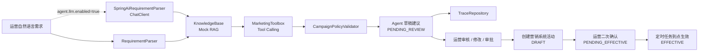

# Marketing Agent Demo

一个面向营销中台内部运营场景的“营销活动配置 Agent”Demo。

项目抽象自内部运营配置活动的实际流程：运营输入一句自然语言活动需求，系统先生成待运营审核的 Agent 草稿建议；运营审核、修改并审批通过后，系统才调用营销中台创建活动，此时活动默认进入 `DRAFT` 状态；运营二次确认后进入 `PENDING_EFFECTIVE`，到活动开始时间后由定时任务推进为 `EFFECTIVE`。

当前版本用于公开展示和面试演示，默认使用本地 mock 数据，不连接真实生产系统，不需要真实 LLM Key，也不依赖数据库。
如果配置 DashScope API Key，也可以启用 Spring AI `ChatClient` 来完成自然语言意图解析。

## 为什么做这个项目

传统营销后台配置活动通常需要填写大量字段：活动时间、人群、券规则、预算、库存、分享奖励、定时任务、风控参数。这个项目验证一种企业级 AI 落地方式：

- LLM / Agent 负责自然语言理解和工具编排
- Java 后端负责确定性业务规则、事务边界、权限隔离和审计
- 写操作分两段：Agent 只生成草稿建议，审批通过后才创建营销系统草稿态活动

## 应用边界

- 面向内部运营人员，不直接面向 C 端用户
- Agent 首次调用只生成待审核草稿建议，不直接创建线上活动
- 查询类工具可由 Agent 编排调用，创建活动、绑定奖品、定时任务等写操作必须进入审批
- 审批通过后创建的活动默认为 `DRAFT`，运营二次确认后才进入 `PENDING_EFFECTIVE`
- trace 记录完整链路，便于回放、审计和规则优化

## 功能清单

- 自然语言需求解析为结构化 `CampaignIntent`
- 意图分流：`CREATE_ACTIVITY`、`CHECK_ACTIVITY`、`QUERY_ACTIVITY`、`RULE_QA`
- 可选 Spring AI `ChatClient`：启用后由通义千问解析活动意图
- RAG 检索模拟：检索历史相似活动样例
- Tool Calling 模拟：查询人群包、查询券库存、检查时间冲突、审批后创建草稿
- JSON Schema 等价校验：必填字段、时间范围、预算、限领、审批状态
- 规则校验链：预算、人群规模、库存、时间冲突、分享奖励、人工审批阈值
- 审批前检查报告：活动摘要、关键字段、风险项、相似案例、工具结果、修改建议
- Trace 审计：记录输入、意图、检索样例、工具调用、草稿、校验结果
- 活动状态流转：`PENDING_REVIEW -> DRAFT -> PENDING_EFFECTIVE -> EFFECTIVE`
- REST API + 单元测试 + MockMvc 测试
- Dockerfile、docker-compose、GitHub Actions

## 运营页面草图

```text
┌──────────────────────────────────────────────────────────────────────────────┐
│ 营销活动配置 Agent                                                           │
├───────────────────────────────┬──────────────────────────────────────────────┤
│ 自然语言输入                  │ Agent 草稿预览                               │
│ ┌───────────────────────────┐ │ ┌──────────────────────────────────────────┐ │
│ │ 福建新用户满30减5，预算10万 │ │ │ 活动名称：福建新用户满30减5活动           │ │
│ │ 每人限领1张，下周五开始... │ │ │ 人群包：AUD-FJ-NEW                       │ │
│ └───────────────────────────┘ │ │ 券规则：满30减5                            │ │
│ [生成草稿]                    │ │ 预算：100000 元                            │ │
│                               │ │ 状态：PENDING_REVIEW                       │ │
│ RAG 命中案例                  │ │ 校验结果：需人工审批 / 无时间冲突           │ │
│ - 福建新用户首单券             │ └──────────────────────────────────────────┘ │
│ - 华东拉新活动                 │ [保存修改] [审批通过并创建活动] [驳回]        │
├───────────────────────────────┴──────────────────────────────────────────────┤
│ 工具调用与 Trace                                                             │
│ searchSimilarCampaigns -> queryAudience -> queryStock -> checkTimeConflict   │
├──────────────────────────────────────────────────────────────────────────────┤
│ 审批后活动状态：DRAFT -> 运营二次确认 -> PENDING_EFFECTIVE -> 到点 EFFECTIVE │
└──────────────────────────────────────────────────────────────────────────────┘
```

## 架构



## 本地运行

```bash
mvn test
mvn spring-boot:run
```

默认启动使用规则解析器，不需要 API Key。

如果要启用 Spring AI：

```bash
export DASHSCOPE_API_KEY=你的Key
mvn spring-boot:run \
  -Dspring-boot.run.arguments="--agent.llm.enabled=true --agent.llm.dashscope.model=qwen-plus"
```

启动后访问：

```bash
curl -X POST http://localhost:8080/api/marketing-agent/drafts \
  -H 'Content-Type: application/json' \
  -d '{"requirement":"下周五到下下周一，针对福建地区新用户，做一个满30减5的首单优惠券活动，预算10万，每人限领1张，分享给好友再送2元无门槛券"}'
```

查询 trace：

```bash
curl http://localhost:8080/api/marketing-agent/traces/{traceId}
```

审批通过并创建活动草稿：

```bash
curl -X POST http://localhost:8080/api/marketing-agent/traces/{traceId}/approve
```

运营二次确认，进入待生效：

```bash
curl -X POST http://localhost:8080/api/marketing-agent/campaigns/{draftId}/confirm
```

模拟定时任务到点生效：

```bash
curl -X POST http://localhost:8080/api/marketing-agent/campaigns/{draftId}/activate
```

查询历史样例：

```bash
curl 'http://localhost:8080/api/marketing-agent/knowledge/samples?query=福建新用户满30减5'
```

## 示例响应

```json
{
  "traceId": "6d1c0...",
  "intentType": "CREATE_ACTIVITY",
  "status": "PENDING_REVIEW",
  "assistantMessage": "活动草稿已生成，包含需要人工审批关注的风险提醒。",
  "draft": {
    "campaignName": "福建新用户满30减5活动",
    "region": "福建",
    "audienceCode": "AUD-FJ-NEW",
    "couponRule": "满30减5",
    "budgetFen": 10000000,
    "perUserLimit": 1,
    "approvalStatus": "PENDING_REVIEW"
  },
  "approvalReport": {
    "activitySummary": "福建新用户满30减5活动，区域：福建，券规则：满30减5",
    "riskItems": ["提醒：MANUAL_APPROVAL_REQUIRED - 预算超过 5 万，必须进入人工审批"],
    "confidence": "MEDIUM"
  },
  "schemaValidationIssues": [],
  "toolCalls": [
    { "name": "searchSimilarCampaigns", "accessMode": "READ_ONLY", "writeOperation": false },
    { "name": "queryAudience", "accessMode": "READ_ONLY", "writeOperation": false },
    { "name": "queryStock", "accessMode": "READ_ONLY", "writeOperation": false },
    { "name": "checkTimeConflict", "accessMode": "READ_ONLY", "writeOperation": false }
  ]
}
```

审批通过后创建营销系统草稿：

```json
{
  "draftId": "DRAFT-6d1c0abc",
  "status": "DRAFT"
}
```

## 生产化改造方向

这个仓库刻意保持轻量，方便 clone 后直接运行。真实生产化可以按下面方向替换：

- `SpringAiRequirementParser`：当前已接入 Spring AI `ChatClient`，后续可升级为更严格的结构化输出 / JSON Schema 约束
- `KnowledgeBase`：替换为 PostgreSQL + pgvector / Elasticsearch hybrid search
- `MarketingToolbox`：替换为营销中台 Feign API / Application Service
- `TraceRepository`：替换为 MySQL / PostgreSQL 表
- `CampaignPolicyValidator`：接入真实活动规则、预算规则、库存规则和审批流

## 代码讲解

面试前建议先看 [docs/interview-code-walkthrough.md](docs/interview-code-walkthrough.md)，里面按“文档要求 -> 当前代码”的方式解释了主链路、读写隔离、Schema 校验、业务规则链和 trace 审计。

## 面试讲法

这个项目不是聊天机器人，而是“配置生成工作流”：

1. 先把自然语言需求解析成结构化意图
2. 再检索历史活动样例，避免模型编造字段
3. 然后通过工具查询人群、库存和时间冲突
4. 先生成待运营审核的 Agent 草稿建议，不直接写生产活动
5. 审批通过后创建营销系统草稿态活动，运营二次确认后进入待生效，到点再生效

核心观点：**Agent 的上限取决于模型，下限取决于工程化。**
