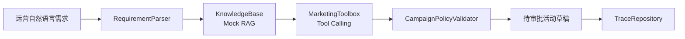

# Marketing Agent Showcase

一个面向 Java 后端面试展示的“营销活动配置 Agent”原型项目。

项目模拟企业营销中台场景：运营输入一句自然语言活动需求，系统生成待审批活动草稿，并展示 RAG 检索、工具调用、规则校验和 trace 审计链路。

当前版本默认使用本地 mock 数据，不需要真实 LLM Key，也不依赖数据库，适合公开到 GitHub 和面试现场演示。

## 为什么做这个项目

传统营销后台配置活动通常需要填写大量字段：活动时间、人群、券规则、预算、库存、分享奖励、定时任务、风控参数。这个项目验证一种企业级 AI 落地方式：

- LLM / Agent 负责自然语言理解和工具编排
- Java 后端负责确定性业务规则、事务边界、权限隔离和审计
- 写操作只生成草稿，不直接上线，最终仍经过人工审批

## 功能清单

- 自然语言需求解析为结构化 `CampaignIntent`
- Mock RAG：检索历史相似活动样例
- Mock Tool Calling：查询人群包、查询券库存、检查时间冲突、创建草稿
- 规则校验链：预算、人群规模、库存、时间冲突、分享奖励、人工审批阈值
- Trace 审计：记录输入、意图、检索样例、工具调用、草稿、校验结果
- REST API + 单元测试 + MockMvc 测试
- Dockerfile、docker-compose、GitHub Actions

## 架构



## 本地运行

```bash
mvn test
mvn spring-boot:run
```

启动后访问：

```bash
curl -X POST http://localhost:8080/api/marketing-agent/drafts \
  -H 'Content-Type: application/json' \
  -d '{"requirement":"下周五到下下周一，针对福建地区新用户，做一个满30减5的首单优惠券活动，预算10万，每人限领1张，分享给好友再送2元无门槛券"}'
```

查询 trace：

```bash
curl http://localhost:8080/api/marketing-agent/traces/{traceId}
```

查询历史样例：

```bash
curl 'http://localhost:8080/api/marketing-agent/knowledge/samples?query=福建新用户满30减5'
```

## 示例响应

```json
{
  "traceId": "6d1c0...",
  "status": "PENDING_APPROVAL",
  "draft": {
    "campaignName": "福建新用户满30减5活动",
    "region": "福建",
    "audienceCode": "AUD-FJ-NEW",
    "couponRule": "满30减5",
    "budgetFen": 10000000,
    "perUserLimit": 1,
    "approvalStatus": "PENDING_APPROVAL"
  },
  "toolCalls": [
    { "name": "searchSimilarCampaigns" },
    { "name": "queryAudience" },
    { "name": "queryStock" },
    { "name": "checkTimeConflict" },
    { "name": "createCampaignDraft" }
  ]
}
```

## 生产化改造方向

这个仓库刻意保持轻量，方便 clone 后直接运行。真实生产化可以按下面方向替换：

- `RequirementParser`：替换为 Spring AI `ChatClient` 结构化输出
- `KnowledgeBase`：替换为 PostgreSQL + pgvector / Elasticsearch hybrid search
- `MarketingToolbox`：替换为营销中台 Feign API / Application Service
- `TraceRepository`：替换为 MySQL / PostgreSQL 表
- `CampaignPolicyValidator`：接入真实活动规则、预算规则、库存规则和审批流
